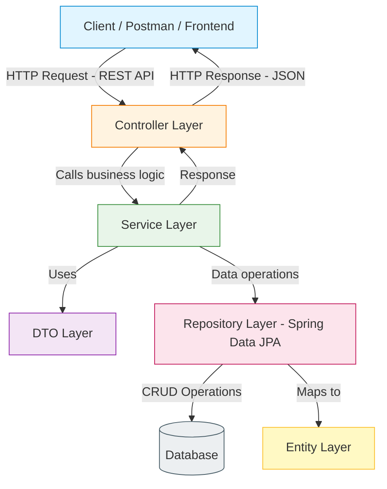
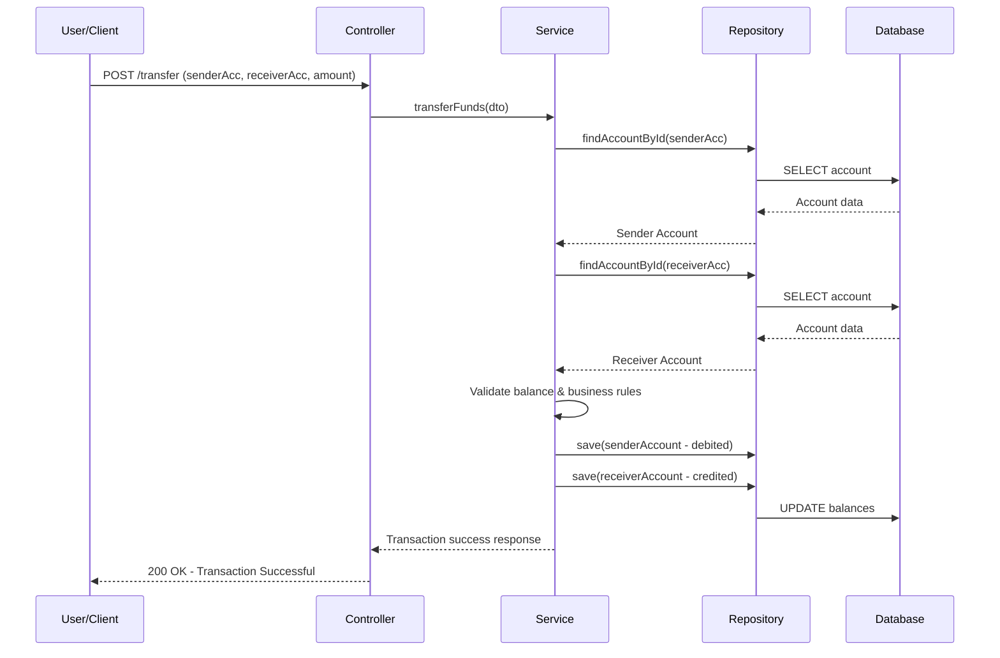

# Banking-Application-using-Spring-Boot

A Banking Application developed using **Java** and **Spring Boot** that provides RESTful APIs for account management and banking transactions such as deposits, withdrawals, and fund transfers. The application follows a **layered architecture** (Controller → Service → Repository → Entity/DTO) with database integration using **Spring Data JPA**.

---

## 🏗️ Architecture Flow



---

## 🔄 Transaction Flow (Example: Fund Transfer)



---

## 🧱 Layered Architecture

| Layer | Responsibility |
|---|---|
| **Controller** | Exposes REST endpoints, handles HTTP requests/responses |
| **Service** | Contains business logic and validation rules |
| **DTO** | Transfers data between client and server without exposing entities directly |
| **Repository** | Interfaces with the database via Spring Data JPA |
| **Entity** | Maps Java objects to database tables |

---

## ⚙️ Tech Stack

- **Language:** Java
- **Framework:** Spring Boot
- **Data Access:** Spring Data JPA / Hibernate
- **Database:** MySQL (or as configured in `application.properties`)
- **Build Tool:** Maven
- **API Testing:** Postman

---

## 🚀 Core Features

- Account creation and management
- Deposit funds
- Withdraw funds
- Transfer funds between accounts
- View account details/balance
- Transaction history (if implemented)

---

## 📂 Typical Project Structure

```
src/main/java/com/banking/app
├── controller/       # REST controllers
├── service/          # Business logic (interfaces + impl)
├── repository/       # JPA repositories
├── entity/           # JPA entities (Account, Transaction, etc.)
├── dto/              # Data Transfer Objects
└── BankingApplication.java
```

---

## ▶️ Running the Project

1. Clone the repository
   ```bash
   git clone https://github.com/<your-username>/Banking-app-springboot.git
   ```
2. Configure your database credentials in `src/main/resources/application.properties`
3. Build and run using Maven
   ```bash
   mvn clean install
   mvn spring-boot:run
   ```
4. Test the APIs using Postman or any REST client at `http://localhost:8080`

---

## 📌 Note

The two diagrams above render automatically on GitHub (Mermaid support built-in). Adjust the entity names, endpoints, and DB config to match your actual implementation once your fork is cloned in Eclipse.
